# Bengaluru Traffic Command — System Architecture

**An event-driven traffic congestion forecasting and resource-optimization platform.**

When an incident or planned event occurs (a crash, a breakdown, a rally, a festival), the system forecasts its traffic impact, generates an executable response plan — control points, manpower, barricades, and real-road diversions — and learns from field outcomes to sharpen future predictions. It targets the operational reality of Bengaluru traffic, where localized events cascade into city-wide congestion and response today is largely experience-driven.

This document is the authoritative technical reference: system context, component design, data model, request lifecycles, the ML and learning pipelines, deployment topology, and the resilience/security posture. Diagrams are Mermaid and render on GitHub.

---

## Table of contents

1. [Design goals & principles](#1-design-goals--principles)
2. [System context](#2-system-context)
3. [Container & component architecture](#3-container--component-architecture)
4. [Component responsibilities](#4-component-responsibilities)
5. [Data model](#5-data-model)
6. [Request lifecycles](#6-request-lifecycles)
7. [Machine learning pipeline](#7-machine-learning-pipeline)
8. [Post-event learning loop](#8-post-event-learning-loop)
9. [Plan lifecycle (state machine)](#9-plan-lifecycle-state-machine)
10. [Real-time integrations](#10-real-time-integrations)
11. [Resilience & graceful degradation](#11-resilience--graceful-degradation)
12. [Deployment architecture](#12-deployment-architecture)
13. [Caching strategy](#13-caching-strategy)
14. [Security & multi-tenancy](#14-security--multi-tenancy)
15. [Observability & operations](#15-observability--operations)
16. [Performance characteristics](#16-performance-characteristics)
17. [Technology stack](#17-technology-stack)
18. [Limitations & roadmap](#18-limitations--roadmap)

---

## 1. Design goals & principles

| Principle | How it shows up |
|-----------|-----------------|
| **Separation of concerns** | ML (`predict`) ≠ geospatial/optimization (`generate_plan`, `allocation`, `diversion`) ≠ transport/API (`main`). Each is independently testable. |
| **Graceful degradation** | Every external dependency has a fallback: no DB → live feeds + seed; no road graph → demo grid; no OR-Tools → greedy; no live feed → fixtures. The service never hard-fails on a missing dependency. |
| **Idempotent, observable startup** | The boot sequence waits for the DB, applies schema, loads data, and seeds — safe to re-run, with diagnostics printed. |
| **Determinism where it matters** | Zone inference, station seeding, and the demo road graph are deterministic so dev/CI is reproducible without network. |
| **Closed feedback loop** | Field outcomes become corrected training labels; retraining measurably moves predictions. |
| **Auditability** | Plan transitions and sensitive actions are appended to an immutable audit log. |

---

## 2. System context

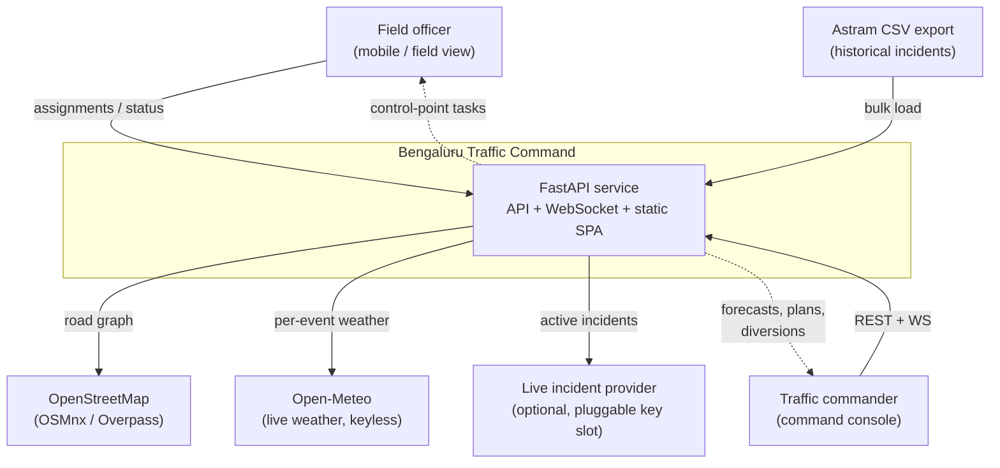

The platform is a single deployable unit (API + bundled SPA, same origin) backed by PostgreSQL, with optional external feeds that all degrade to fixtures.

---

## 3. Container & component architecture

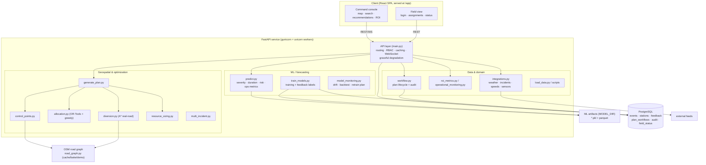

---

## 4. Component responsibilities

| Module | Responsibility | Key fallback |
|--------|----------------|--------------|
| `backend/api/main.py` | HTTP/WS endpoints, RBAC, request context, signature caching, response shaping, **degradation guards** | DB down → live feeds + zeroed metrics |
| `backend/ml/predict.py` | Forecast engine: severity prob, duration quantiles (Q25/50/75) + survival adjustment, risk score, operational metrics | Missing artifacts → `FileNotFoundError` (signals retrain) |
| `backend/ml/train_models.py` | Training pipeline; merges officer feedback as corrected labels; writes artifacts | CSV fallback when no DB |
| `backend/ml/model_monitoring.py` | Drift detection, backtests, retrain recommendation | — |
| `backend/optimization/generate_plan.py` | Orchestrates a deployment plan end-to-end | warnings on partial failure |
| `backend/optimization/control_points.py` | Finds control points on the road graph (arterial-weighted) | demo graph |
| `backend/optimization/allocation.py` | Personnel/barricade allocation | OR-Tools → greedy → subprocess-isolated |
| `backend/optimization/diversion.py` | Real-road A* diversions, congestion/risk weighted, true geometry | advisory routes / demo grid |
| `backend/optimization/resource_sizing.py` | Severity → resource counts | — |
| `backend/optimization/multi_incident.py` | Concurrent multi-incident coordination | — |
| `backend/geo/road_graph.py` | OSM graph load/cache/bake; **demo-grid fallback** | runtime demo fallback (no request-time download) |
| `backend/integrations/integrations.py` | Live feeds: weather (live), incidents (keyed), speeds/sensors (fixtures) | per-feed fixtures |
| `backend/data/workflow.py` | Plan versioning, approval chain, audit log | JSONL when no DB |
| `backend/data/load_data.py` | CSV normalize/dedupe/zone-infer/**duration cleaning** | — |
| `backend/monitoring/*` | ROI, operational metrics, platform health, retention | safe defaults |
| `backend/config/{db,env_loader}.py` | Engine factory (lazy, pool pre-ping), env loading | — |

---

## 5. Data model

PostgreSQL is the system of record. PostGIS is **not** required (Render-managed Postgres lacks it); geospatial math is done in Python (`geo_utils.haversine`). Multi-tenancy is carried by `tenant_id` columns.

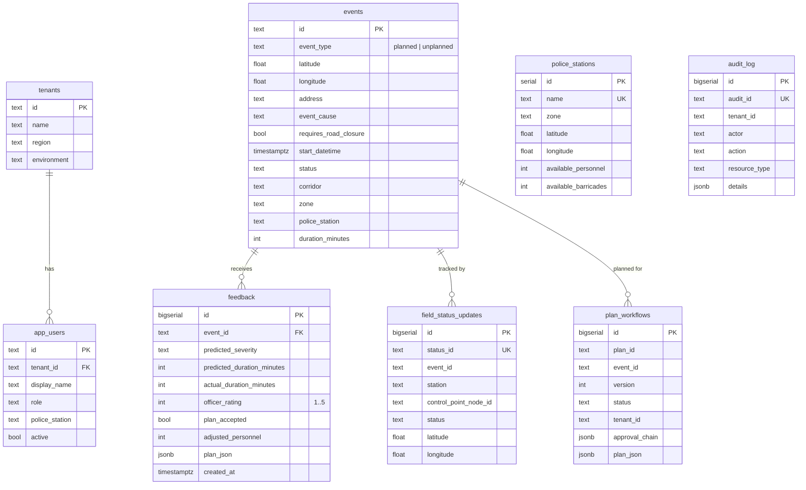

**Data quality:** the loader nulls implausible durations (negative, or > 24 h — administrative "ticket left open" artifacts) so they act as censored observations rather than skewing statistics. This dropped the dataset's mean duration from ~6,234 min to ~99 min.

---

## 6. Request lifecycles

### 6.1 Forecast

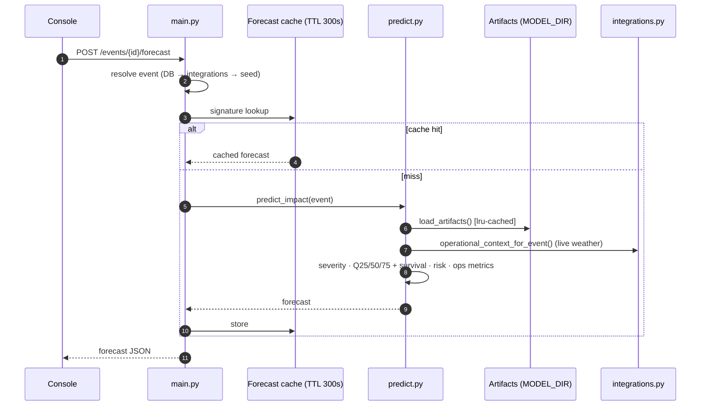

### 6.2 Deployment plan

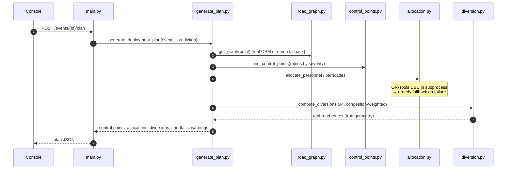

### 6.3 Feedback + live broadcast

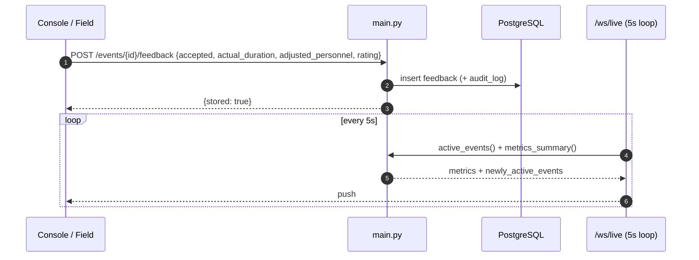

---

## 7. Machine learning pipeline

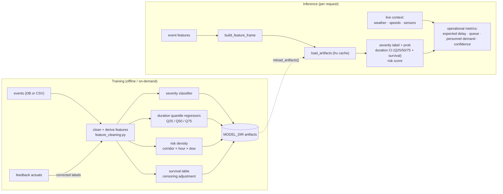

**Models:** XGBoost/LightGBM via scikit-learn pipelines. Duration is modeled as **quantile regression** (not a point estimate) to express uncertainty, then corrected for right-censoring (incidents still open at data cutoff bias the median low). Risk density is a lookup table with corridor → corridor-average → global-average fallbacks.

---

## 8. Post-event learning loop

The loop is closed and **empirically verified to move predictions**: in a controlled test, injecting officer feedback (actual = 300 min) for a corridor shifted its predicted median from **35 min → 277 min** after retraining.

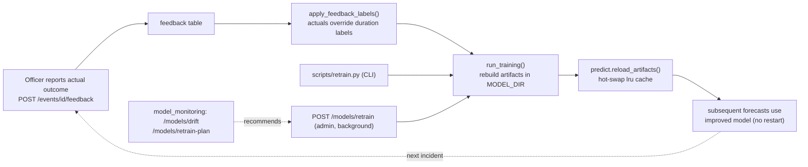

Retraining runs in a background thread on the API (fast on the current dataset) or via the CLI. Drift can be inspected before deciding to retrain.

---

## 9. Plan lifecycle (state machine)

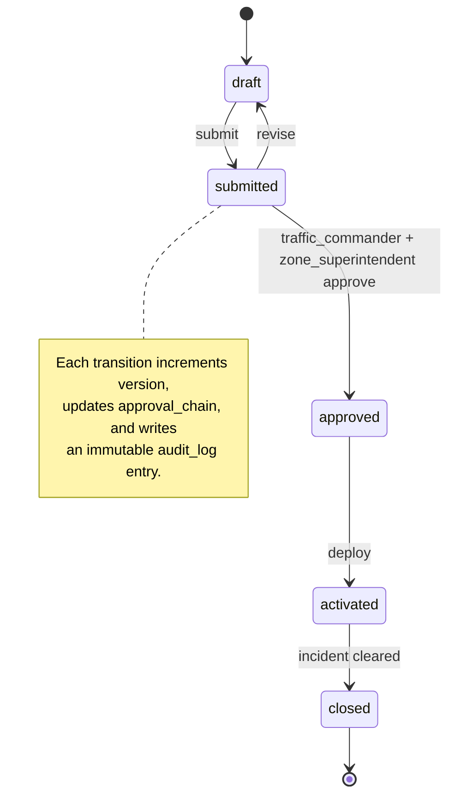

---

## 10. Real-time integrations

All feeds live behind `integrations.py` and degrade to fixtures, so the app never breaks on a missing feed or key.

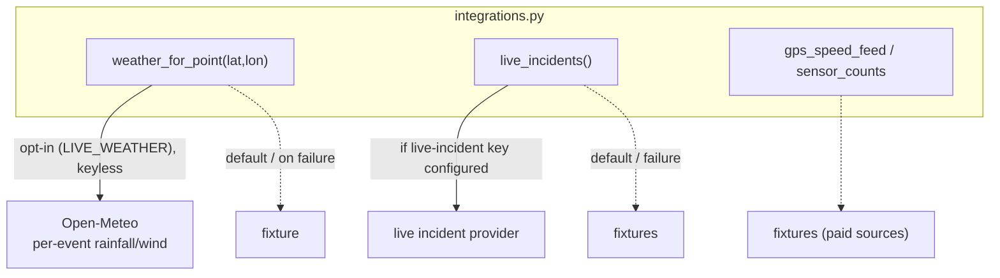

| Feed | Source | Status |
|------|--------|--------|
| Weather | Open-Meteo | **Opt-in** (`LIVE_WEATHER=true`), keyless, per incident location → drives delay/flood factors; fixtures by default |
| Incidents | Pluggable provider | Realistic fixtures by default; integrations layer exposes a configurable live-incident API-key slot |
| GPS speeds | — | Fixture (real source needs a paid API) |
| CCTV/ANPR counts | — | Fixture (needs integration) |

> Live external fetches are opt-in so the deployed server makes no blocking
> network calls in request paths (a key reason for prior health-check timeouts).

Live values are TTL-cached per coordinate and fetched with verified TLS (certifi) and short timeouts so they never block the request path.

---

## 11. Resilience & graceful degradation

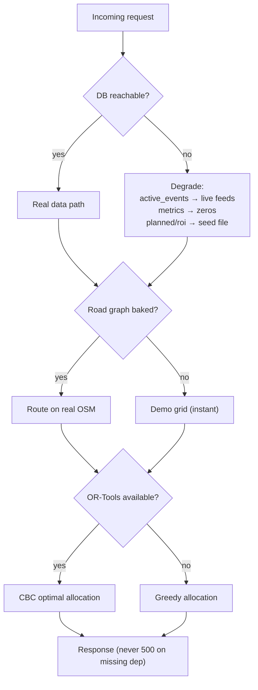

Each fallback is independently exercised; the WebSocket loop also catches per-tick errors so a transient backend hiccup never drops the live connection.

---

## 12. Deployment architecture

Single Docker image (multi-stage: frontend build → Python runtime), deployed via a **Render Blueprint** that provisions a free Postgres + a web service.

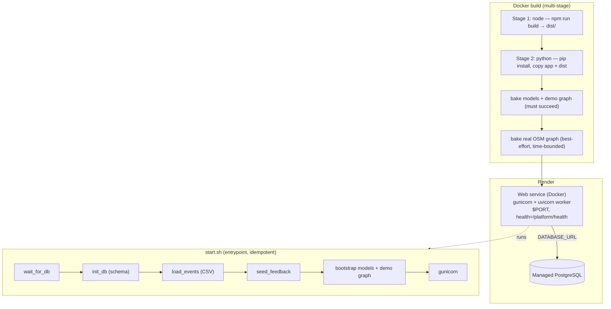

**Build robustness:** the real-graph download is time-bounded (`timeout`) and non-fatal — it can neither hang nor fail the build. If it doesn't complete, runtime falls back to the demo grid. This prevents the classic failure where a hung build leaves a stale container serving a pre-`DATABASE_URL` config.

---

## 13. Caching strategy

| Cache | Scope | TTL | Key |
|-------|-------|-----|-----|
| Forecast | in-process dict | 300 s | event signature (id, status, cause, corridor, …) |
| Plan | in-process dict | 600 s | event signature |
| Model artifacts | `lru_cache(maxsize=1)` | until `reload_artifacts()` | MODEL_DIR |
| Weather | per-coordinate dict | 600 s | rounded lat,lon |
| Incidents | in-process dict | 120 s | bbox |
| Road graph | memory + disk + baked | bbox-coverage check | bbox |

Signature-based keys mean a forecast is recomputed only when the event materially changes, not on every poll.

---

## 14. Security & multi-tenancy

- **Multi-tenancy:** `tenant_id` on tenants/users/plans/audit; headers `X-Tenant-Id`, `X-User-Id`, `X-User-Role` carry request context.
- **RBAC:** `require_roles(...)` guards privileged endpoints (e.g., `POST /models/retrain`, retention).
- **Audit:** every sensitive action appends to `audit_log` (append-only, per-tenant, indexed by time).
- **Secrets:** API keys and `DATABASE_URL` come from the environment only; `.env` is git- and docker-ignored.

> **Honest limitation:** authentication is currently header-based (trusting `X-User-Role`). This is acceptable for a pilot but **must be replaced with real authentication (JWT/OAuth/session) before any public deployment.** See the roadmap.

---

## 15. Observability & operations

- **Health:** `GET /platform/health` (DB connectivity, integration count) — used as the Render health check.
- **Startup diagnostics:** `start.sh` prints `DATABASE_URL set`, `ROAD_GRAPH_MODE`, `MODEL_DIR`, and dist contents.
- **Degradation breadcrumbs:** functions log when they fall back (e.g., `active_events: database unavailable, using live feeds only`).
- **Model health:** `GET /models/drift`, `GET /models/retrain-plan`, `GET /models/backtest`.
- **Business metrics:** `GET /metrics/summary`, `/metrics/roi`, `/metrics/operational`.

---

## 16. Performance characteristics

| Operation | Latency (approx) | Notes |
|-----------|------------------|-------|
| Forecast (cache hit) | ~50 ms | dict lookup |
| Forecast (cache miss) | ~0.5–2 s | ML inference + live context |
| Plan generation | ~0.5–4 s | graph fetch cached; allocation fast |
| Full retrain | ~4 s (current dataset) | severity + 3 quantiles + risk + survival |
| Live weather fetch | <1 s, ≤ once / 600 s / point | TTL-cached |
| WebSocket broadcast | every 5 s | metrics + newly-active events |

---

## 17. Technology stack

| Layer | Technology |
|-------|-----------|
| API | FastAPI 0.4.0, Gunicorn + Uvicorn workers, WebSockets |
| ML | XGBoost / LightGBM, scikit-learn |
| Optimization | Google OR-Tools (CBC) + greedy fallback |
| Geospatial | OSMnx, NetworkX (A\*), haversine utilities |
| Data | PostgreSQL 15, SQLAlchemy 2, pandas |
| Frontend | React 18, Vite, Leaflet |
| Live data | Open-Meteo (weather, opt-in); pluggable live-incident provider (fixtures by default) |
| Deploy | Docker (multi-stage), Render Blueprint |

---

## 18. Limitations & roadmap

**Known limitations (stated honestly):**

- **Auth is header-based** — needs real authentication before production.
- **Synthetic inputs** — police-station inventory is deterministically seeded; GPS speeds and sensor counts are fixtures.
- **Unvalidated coefficients** — operational metrics (e.g., affected-users-per-minute) are estimates, not yet calibrated against ground truth.
- **Modest labeled data** — duration labels and feedback are limited; the learning loop improves this over time.
- **Free-tier deploy trade-off** — the real OSM build can be slow; the app falls back to the demo grid to keep deploys reliable.

**Roadmap:** real authN/Z · calibrated impact coefficients · live GPS/sensor feeds · scheduled/automatic retraining on a dedicated worker · congestion-aware baseline speeds · parameterization for other cities.

---

### Related documentation

| Doc | Contents |
|-----|----------|
| [README.md](README.md) | Project overview & MVP highlights |
| [HOW_TO_RUN.md](HOW_TO_RUN.md) | Local development & configuration |
| [DEPLOY_RENDER.md](DEPLOY_RENDER.md) | Render deployment guide |
| [CLAUDE.md](CLAUDE.md) | Module-by-module data/ML reference |
| `/docs` (runtime) | Interactive OpenAPI explorer |
